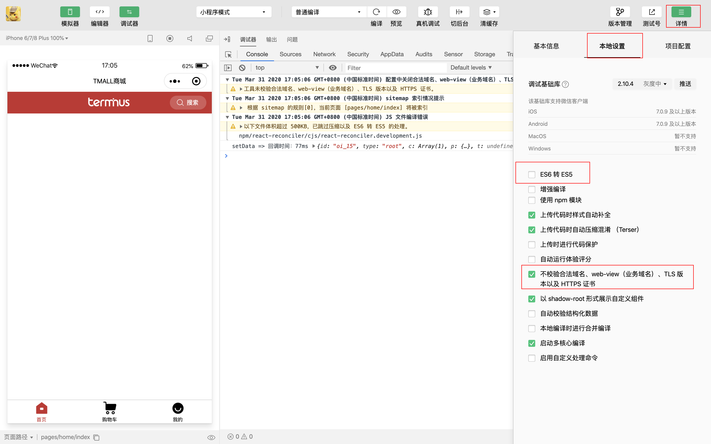

# 启动

## 依赖安装

工程目录下执行

```shell
 npm i
```

ios 目录下执行

```shell
cd ios
pod update --no-repo-update
```

启动 node server

```shell
# 根目录下执行
npm run start
```

## iOS 启动

根目录下执行

```shell
npm run ios
```

## android 启动

- 首先启动模拟器 或者 直接数据线连接真机并起开[debug 模式](https://developer.android.com/studio/debug/dev-options.html?hl=zh-cN)
- 执行 debug 打包命令

  ```shell
  npm run android
  ```

Android 打包过程中如果提示依赖无法安装，请打开阿里郎的加速或者自行准备代理

## h5 启动

- 进查看效果，无需后端接口交互直接执行一下命令即可

  ```shell
   # 根目录下执行
   npm run demo
  ```

- 项目需要接口交互

  - 自行配置`Pampasfile.js`
  - 根据项目要求是否需要配置 NGINX

    ```shell
    # 根目录下执行
    npm run dev
    herd
    ```

## 微信小程序启动

```shell
# 根目录下执行
npm run watch:wechat 微信小程序开发编译
npm run build:wechat 微信小程序生产编译
npm run watch:alipay 支付宝小程序开发编译
npm run build:alipay 支付宝小程序生产编译
```

编译完成之后，会在项目根目录生成 dist 文件夹

### 微信小程序导入

打开小程序 ide，微信扫码登录，入口页面选择小程序，点击"+"图标，选择“导入项目”，目录选择项目根目录下的 dist/wx，AppID 点击下方的“测试号”生成，导入即可

### 微信小程序 ide 设置

修改设置 Settings --> Project Settings --> Local Settings(或设置-->项目设置-->本地设置):

- 勾选不校验合法域名、web-view...
- 反选 ES6 转 ES5(可以减少编译时间)


